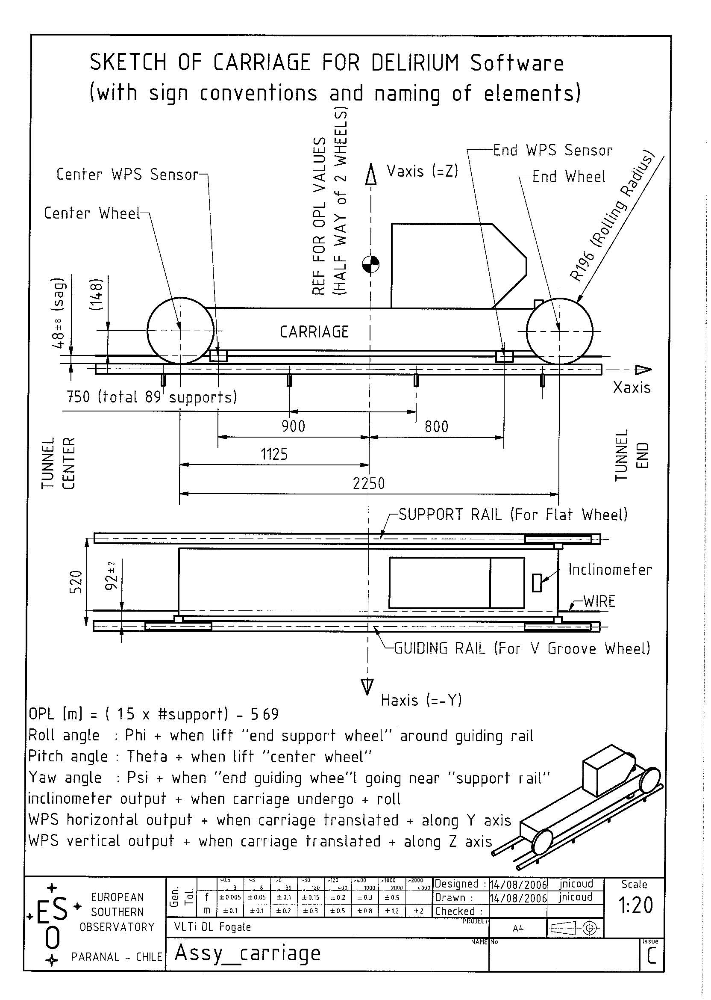

title: README.md  

# Delay lines Delirium script

## Data 
The delirium data are taken every day by moving the delay line, step by step, and measuring the position in space of the carriage thanks to 2 Fogales (no contact, detectors) and an inclinometer. The measures are taken every 0.375 m opl (opl = 2 X physical distance). Every wwednesday also data are taken back and forward to check the hysteresis.

Data are written in a ascii regular table, opl  in meter and Fogale positions Y and Z in mm, the inclinometer is in radian. The two Fogale detectors are named "center" (for the one closest to the tunnel center ) and "end" (for the one closest to the tunnel extremities). 

### Fogale WPS correction 

The string sustained only on both side of the tunnel, meanings that it has a parabolic shape in the vertical direction and is lineary shift in horizontal. The Fogale are not exactly in horizontal/vertical position, so there are residuals vertical parabola in the horizontal data and vis versa. The data is reprojected to make the detector straight. The reprojection matrix is unique for each carriage and is set in the `sensors.py` file. 

## Code Structure 

The code has been rewritten from the previous Matlab script. The matlab script was written sequentially, step by step and grew anarchically over the years.  Instead it has been rewritten with Python in a object oriented fashion. This in order to make it clearer and to allow the code to evolve safely. 

The defined Python objets are logical and correspond to the physical components of the delay line :

\newpage
------

```
DelayLine (can have several States)
       |
       +-- n DelayLineState (e.g. n=2 for hysteresis)
                 |
                 +-- 1 Delirium (file)   >.....   
                 |                            .
                 +-- 1 Carriage <......       .      >..........
                 |        |           .       .                .
                 |        +-- Sensors ^   <....                .
                 |              |                              .
                 |              + 2 Fogale                     .
                 |              + 1 Inclinometer               .
                 |                                             .
                 +-- 1 Rails >.............         <...........  
                        |                 .
                        + 1 Supports  <....     

```

- Sensors get their value from the Delirium file
- Carriage attitude is computed from Sensors 
- Rails y,z profile is computed from Carriage attitude
- Supports corrections is computed from Rail profiles (and interaction matrix)


`DelayLineState` (represent a state of a delayline computed from a delirium file). 

    1 Carriage. (Contain carriage coordinate convention function)
         Sensors. 
            2 Fogale (Contain the Fogale projected value)
            1 Inclinometer (inclinometer value)
    1 Rails. (Contains the reconstructed rail coordinates)
          Supports. (Contain The state, and correction to apply on each supports)
    1 Delirium. (Contain the data file and functions to read/handle it)

`DelayLineHysteresis` (contain two DelayLineState objects one forward, one backward)

Each object is defined in its own file. Some other files (sub modules) are also defined :

- `parameters.py` define parameters names and descriptions
- `computing.py` contain common functions 
- `log.py`  handle the log stdout 
- `io.py` input output, functions to find, list and open data files remotely or locally.
- `wobblefit.py` define the class fitting for wobble
- `plots.py` All the plots are written here
- `run.py` handle the automatics computation, plots and webpage creation.


### Sensors

Sensors need a Delirium file, from it the Sensors object gives the following value arrays (from the `.get(key)` method):

- `opl [m]` Twice the physical distances
- `incl [rad]`  the inclinometor value (it is the `phi` of a carriage) 
- `yctr [mm]` y measurement of the fogale close to tunel center
- `zctr [mm]` z measurement of the fogale close to tunel center 
- `yend [mm]` y measurement of the fogale close to tunel end 
- `zend [mm]` z measurement of the fogale close to tunel end  
sensor position are corrected from WPS roll error. 

Sensors have the following sub Objetcs:

- `.ctr` Fogale object of fogale close to tunel center
- `.end` Fogale object of fogale close to tunel end
- `.incl` Inclinometer object 

#### Fogale 
Fogale represent a fogale detector. Is has the following value arrays: 

- `opl [m]` Twice the physical distances
- `y [mm]` y measurement of the fogale
- `z [mm]` z measurement of the fogale 

Each Fogale has a one configuration value, the WPS roll correction angle. Different for each DL, 
these angles are set in the `fogale_angle_lookup` lookup dictionary in `sensors.py`

#### Inclinometer
Inclinometer represent the inclinometer sensor.  Is has the following value arrays:

- `opl [m]` Twice the physical distances
- `incl [rad]`  the inclinometer value (it is the `phi` of a carriage) 

## Carriage
The carriage is defined from a Sensors object (itself defined from a delirium file). It represent the carriage position and angle at each opl.

The carriage can be defined in space by 6 parameters (6 array values): 

- `opl [m]`
- `horizontal [mm]`  horizontal position *It is the oposite of the rails y-axis (see figure)*
- `vertical [mm]`  vertical position
- `phi [rad]`   Roll angle
- `theta [rad]` Pitch angle
- `psi [rad]`   Yaw angle 

This natural coordinates can be transformed to Fogale+Inclinometer measurements by geometric consideration of the carriage dimensions and position of the sensors on it. 
The attached figure shows the carriage and the main cotes.


\newpage

The transformation matrix between carriage position (Attitude) and Fogale position is called A2D and is:

     | opl  |    | 1  0  0  0   0  0  |    | opl    |
     | incl |    | 0  0  0  1   0  0  |    | horiz. |
     | ystr | =  | 0  1  0 -48  0 -900| X  | vert.  |
     | zctr |    | 0  0  1  92  900 0 |    | phi    | 
     | yend |    | 0  1  0 -48  0  800|    |theta   |  
     | zend |    | 0  0  1  92 -800  0|    | psi    |

The attitude coordinate is computed thanks to the A2D inverse matrix (D2A) and Fogale delirium position.

However before transformed, the fogale positions has to be corrected from the low orders deformation of the stringdue to gravity in the vertical position and miss-placement in horizontal position. The string deformation is computed on one fogale (the center one) with a 2 degree polynome fitting for the vertical position and 1 degree for the horizontal position. The model is then applied to both fogale (this is necessary to do that in order to keep histeresis information).

Notes: the parameters for fitting, like degree of fit, can be changed in the `parameters.py` file.  

Configuration: the configuration are at the begining of the class definition, they are phisical dimension and placement of the carriage coponant (*for historical reasons there is a (m,mm) mix in units*):


var                default value   unit  description                      
------------------ --------------- ----- -------------
`wheel_distance`   2.25            m     Physical separation between wheels
`sensor_distance`  1.7             m     Physical separation between sensors
`wheel_radius`     0.196           m     (exact design value 195.81)
`rail_distance`    0.520           m     Separation between rails in y direction
`Fend`             [ 800,92,48]    mm    x,y,z  end fogale position 
                                         from carriage center
`Fctr`             [-900,92,48]    mm    x,y,z center fogale position 
                                         from carriage center
`Wend`             [1125,0,0]      mm    1125 = `1000*wheel_distance/2.`
                                         Positions of end wheel contact point
`Wctr`             [-1125,0,0]     mm    Positions of center wheel contact point


### Rail

The rail deformation state is computed from the carriage attitude positions.

With the attitude coordinate in hand, the x (opl), y and z coordinates of the guiding rail is computed by projecting the carriage wheel contact points. That lead us to two measurements (2) wheels), the average of the two independent measurements is taken for each opl.

The following transformation matrices are used (defined in `carriage.py`) :
  
    For center wheel 
                                              | opl |
      | x |    | 1  0  0  0     0     0 |     | H   |                   
      | y |  = | 0 -1  0  0     0  1125 | X   | V   | 
      | z |    | 0  0  1  0  1125     0 |     | phi |
                                              |theta|
                                              | psi |    
     


    For end wheel                                                
                                              | opl |
      | x |    | 1  0  0  0     0     0 |     | H   |                   
      | y |  = | 0 -1  0  0     0 -1125 | X   | V   | 
      | z |    | 0  0  1  0 -1125     0 |     | phi |
                                              |theta|
                                              | psi |                                                

*Note here the sign -1 for the y axis which is in the opposite direction of Haxis (see carriage figure above)*

However before computing the wheel contact points two things are made:

- the wobble is filtered for each relevant parameters that can have a wobble period. The period for each parameters is defined in `parameters.py`. The period can be an intelligible string `"wheel"` (wheel perimeter x 2) or `"supports"` (support distance x 2) or a float expressed in opl (physical distance x 2). The wobble filtering can be switched on/off with the `filterCarriageWobble` in the rail class definition (in `rail.py`)
- the low order of the carriage attitude is removed for some parameters in order to eliminate the carriage global tilts. Again order of the fits parameter is determined in `parameters.py`. Low order removal can be switched on/off with the `removeCarriageLowOrder` in the rail class definition (in `rail.py`)

Rail has the following array values :

- `x [opl]`
- `y [mm]`  deformation along y axis
- `z [mm]`  deformation along z axis

And the following configuration parameters:

var                       default value unit description
----------------------    ------------- ---- -----------
`support_sep`             0.75          m    Separation between support 
                                             in physical distances
`support_offset`          5.69/2.       m    Position of the first support 
                                             in physical distances
`filterCarriageWobble`    True               Filter the wobble on relevant 
                                             carriage parameters
`removeCarriageLowOrder`  True               Remove low order of relevant 
                                             carriage parameters


### Supports 

The supports object contain the correction to apply to each support to make the rail straight. These corrections are computed from a Rail object and rail/support interaction matrix (from a static fits file).

Supports has the following array values:  

- `supports` support number
- `Hcorrection [mm]` Correction to apply in the Horizontal direction
- `Vcorrection [mm]` Correction to apply in the Vertical direction

And the following configuration parameters:


var                    default value   unit  descr                            
---------------------- --------------- ----  --------------------------------
`correction_treshold`    0.007           mm   Threshold for which the 
                                              corrections will be logged      
`maxcorwarning`          0.05            mm   Print a warning if some 
                                              correction above this
`removeRailLowOrder`     True                 Remove low orders on rail before 
                                              computing correction.
`railLowOrderRange`      "good"          opl  tuple(min,max) range of the 
                                              low order fit range (in opl).
                                              This can be a string, the
                                              correspondence between           
                                              string and range is defined in
                                              the DelayLineState class definition in `dl.py` file
`filterRailWobble`       False          opl   Normally it is false since
                                              wobble has been corrected before 
                                              computing the rail deformation
-----------------------------------------------------------------------------


    

